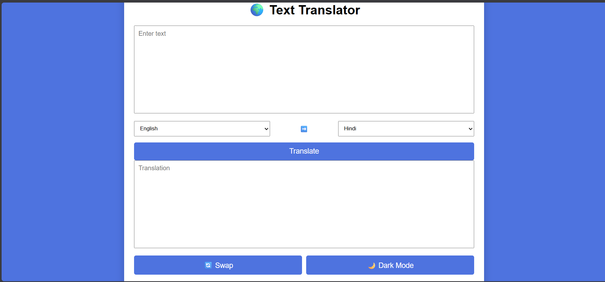
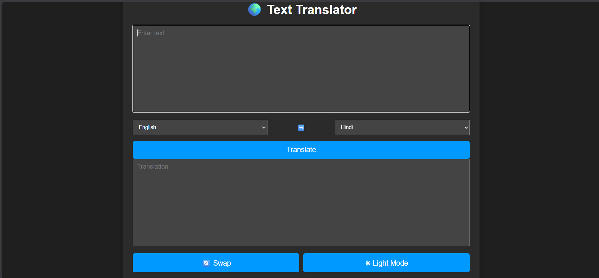

# 🌐 Translator Mini Project

A simple and responsive language translator built using HTML, CSS, and JavaScript.

## 🚀 Features
- Translate text between multiple languages
- Copy translated text
- Responsive Design
- Easy to use interface

## 🛠️ Technologies Used
- HTML5
- CSS3
- JavaScript
- Translator API

## 📂 Project Structure
index.html
style.css
script.js

## ▶️ How to Run
1. Download or Clone the repository.
2. Open index.html in your browser.

## 📸 Screenshots
## 📸 Home Page

## 📸 Dark-mode page

## 👩‍💻 Author
Pari Jain